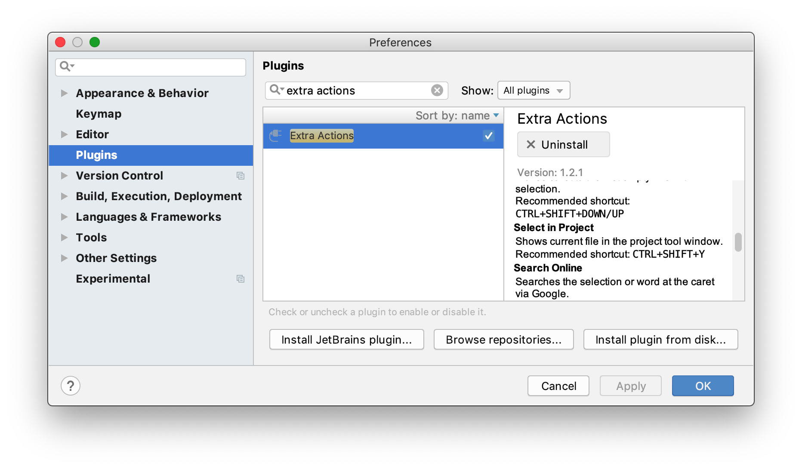

Awesome Terminal Stuff
======================

Here's some stuff I use.

## ohmyzsh

Just install that first.

## vim

	$ ln -s .vimrc ~/.vimrc

## .zshrc / .aliases

	$ echo "source `pwd`/.zshrc" >> ~/.zshrc
	$ echo "source `pwd`/.aliases" >> ~/.zshrc

## Other stuff

At this point this acts as more of a TODO list for me when setting up new dev environments; I'm too lazy to write a script to just set it up all automatically cause I'm not in IT and don't spin up a new Mac every other day.

* [oh my zsh](https://github.com/robbyrussell/oh-my-zsh)
* [Sublime Text](http://www.sublimetext.com/docs/2/osx_command_line.html):
	```
	$ mkdir ~/bin
	$ ln -s "/Applications/Sublime Text 2.app/Contents/SharedSupport/bin/subl" ~/bin/subl
	```

* [Homebrew](http://brew.sh)
* [rbenv](https://github.com/sstephenson/rbenv#homebrew-on-mac-os-x)
	```
	$ brew update
	$ brew install rbenv ruby-build
	```

* Ruby
	```
	# list all available versions
	$ rbenv install -l
	$ rbenv install 2.1.0
	```

# Not Terminal, But Good

## IntelliJ

### Show current file in project

1. Install the "Extra Actions" plugin
	
	
2. Configure the keymap for the new "Select in Project" action to be **⇧⌘J** (same as it is in Xcode).
	
	
3. Do this for each IntelliJ-based IDE (Android Studio, RubyMine, etc) that you're using.
4. That's it! Hit **⇧⌘J** at any time to show the current file in the project navigator.